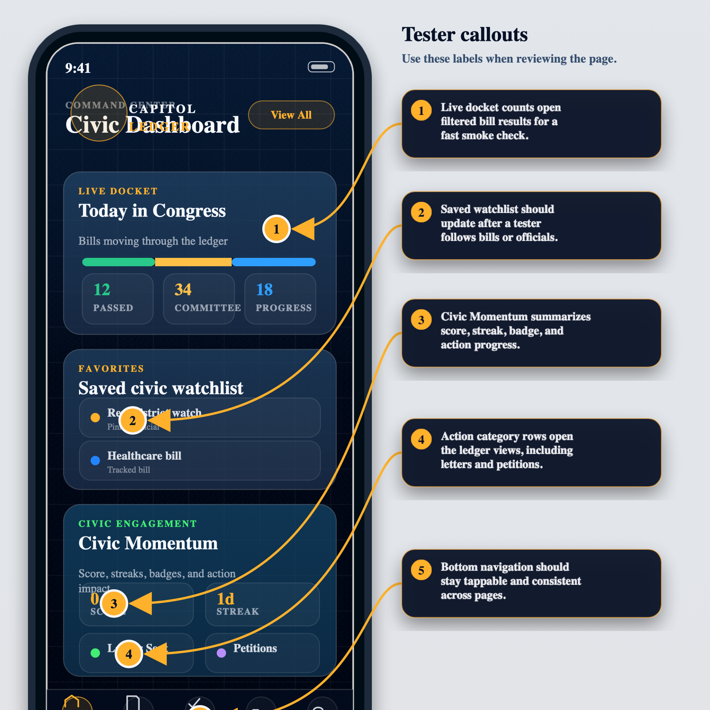
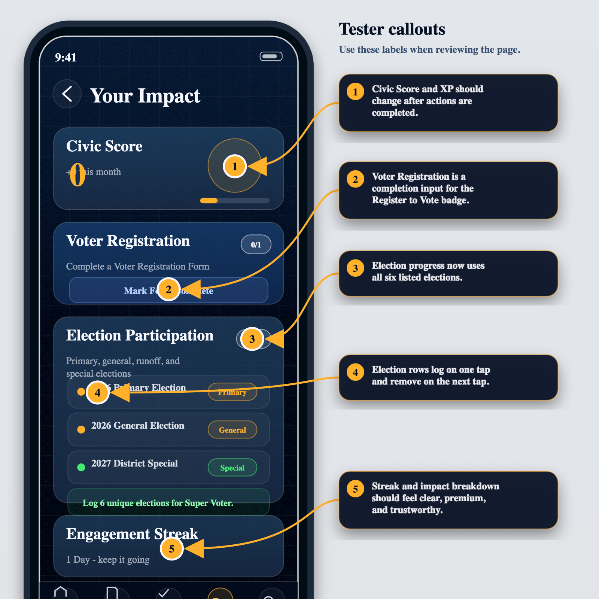
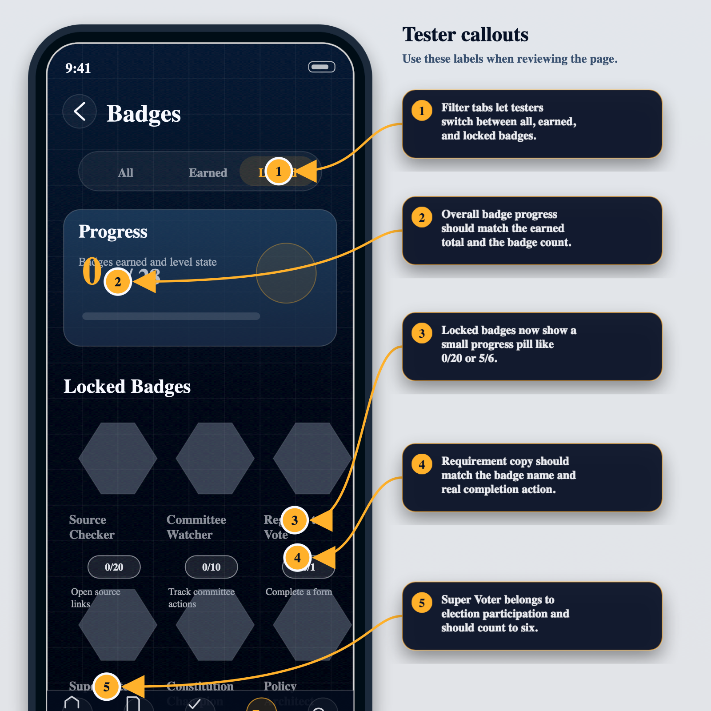
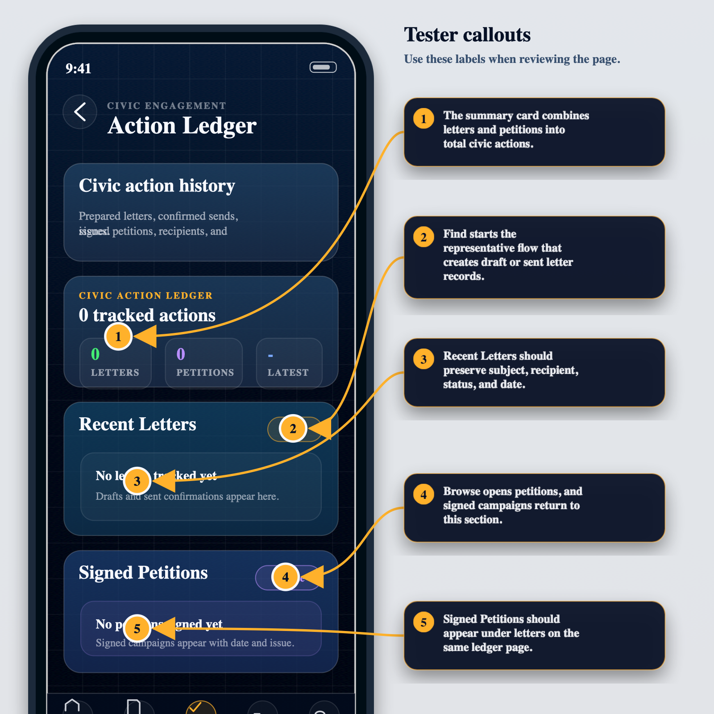
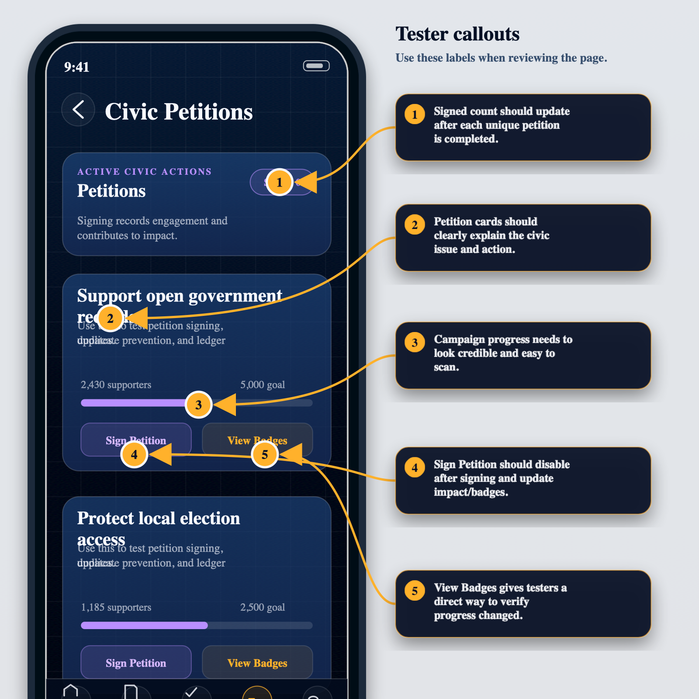
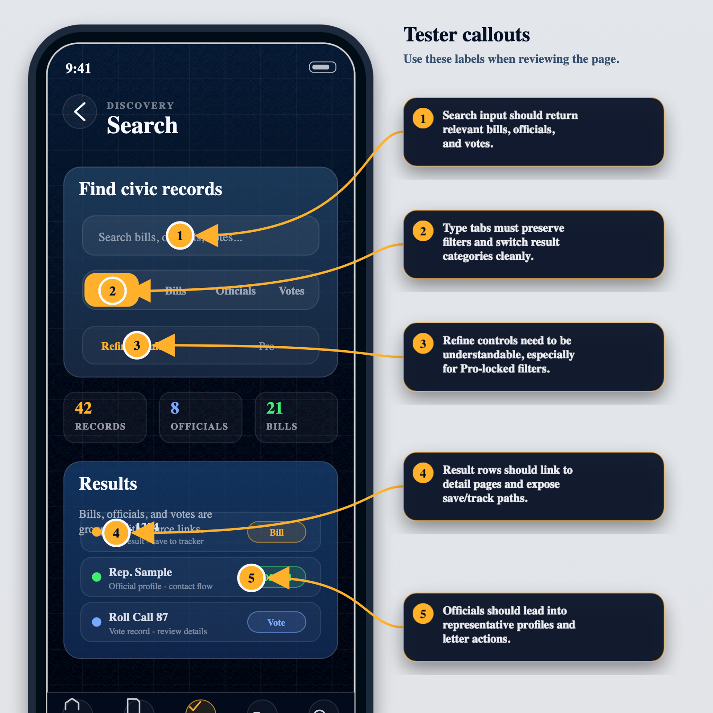
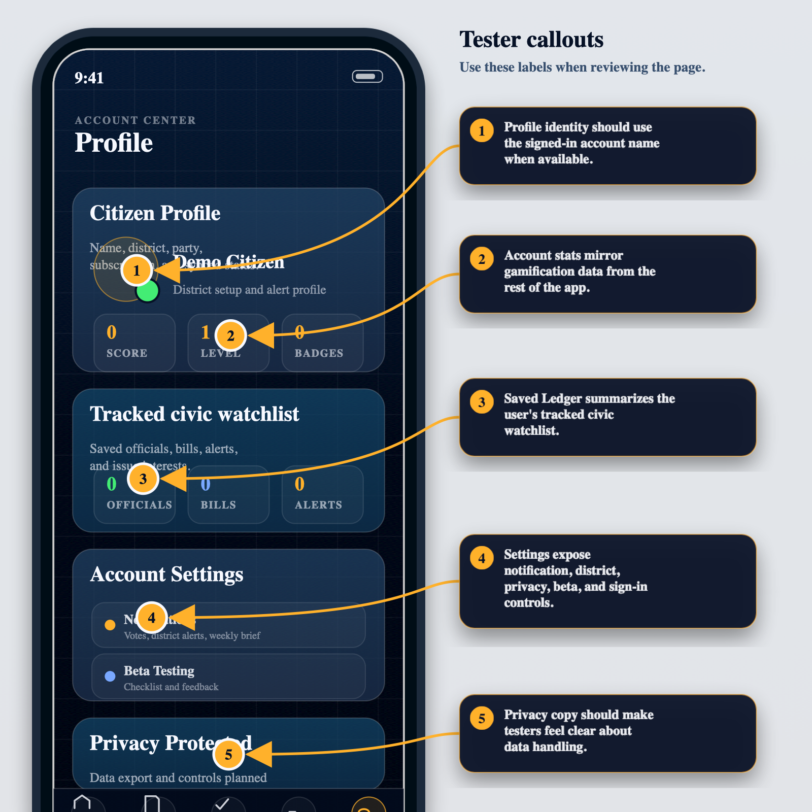

# Capitol Ledger CE First-Round Beta Tester Guide

## What Capitol Ledger CE Is

Capitol Ledger CE is a mobile-first civic tracking app for people who want to follow bills, representatives, votes, alerts, and their own civic engagement without bouncing between scattered government sites and news feeds.

I created Capitol Ledger CE because civic information is too fragmented for regular people to use consistently. The goal is to make it easier to know what is happening, save what matters, contact the right officials, and build the habit of civic participation without needing to be a policy expert.

This first beta round is about trust, clarity, and basic usability. The app should feel useful, premium, and calm, even when the underlying civic data is complex.

## How To Be A First-Round Beta Tester

Use Capitol Ledger CE like you would use a real civic companion app. Do not just click through screens. Try to complete small real-world tasks:

- Find a bill or official that interests you.
- Save something to your watchlist.
- Open alerts and mark activity as read.
- Prepare or confirm a representative letter.
- Sign a petition.
- Mark voter registration completion.
- Log election participation.
- Compare the Free, Pro, and Team subscription plan screens.
- Check whether badges, score, streak, and impact totals update.
- Return later or refresh to see whether the app remembers your work.

Use test-safe information. Do not enter private personal data that you would not want stored in a beta environment.

## What We Are Looking For

Send feedback when something feels confusing, broken, misleading, too small to tap, too hard to read, or less trustworthy than it should. The most useful beta feedback will cover:

- Navigation: pages should be easy to move through, scroll, and return from.
- Clarity: labels, badge requirements, empty states, and button text should explain what happens next.
- Gamification: score, streaks, badges, and progress counts should update after actions.
- Persistence: saved bills, officials, letters, petitions, elections, and profile settings should remain after refresh.
- Subscriptions: plan names, pricing, billing-cycle controls, upgrade buttons, and locked-feature language should feel clear and trustworthy.
- Data trust: bill, vote, official, and source labels should feel accurate and credible.
- Mobile feel: no clipped text, stuck scrolling, dead taps, overlapping content, or cramped controls.
- Premium feel: cards, charts, progress indicators, and empty states should feel polished enough for testers.
- Crashes: any blank screen, stuck preview, console error, or page that fails to load.

## How To Report Feedback

Use the feedback reporting inside Capitol Ledger CE whenever possible. This keeps tester notes in the beta review queue instead of scattering them across texts, emails, or screenshots.

Browser bypass link, use this if the tester needs to open the feedback form directly:
https://project-qosv1.vercel.app/feedback?source=beta

Regular in-app beta checklist link, use this for the normal tester flow:
https://project-qosv1.vercel.app/beta

To report from inside the app:

1. Open the Beta Testing checklist from the Account/Profile page, or use the regular beta checklist link above.
2. Pick the flow you are testing and tap Report on that row.
3. On the Feedback page, choose the Type: Bug, Flow, Missing, Data, Design, or Other.
4. Choose the Impact: Low, Medium, or High.
5. Choose where it happened, such as Dashboard, Search, Bill detail, Official profile, Alerts, Badges / impact, Account / sign-in, or Beta checklist.
6. Add a short title that names the problem.
7. In What happened?, describe what you tried, what happened, what you expected, and whether it blocked you.
8. Add an email only if you want follow-up.
9. Tap Send Feedback.

If the form confirms that feedback was saved to the beta review queue or captured in demo mode, the report went through. If the feedback form itself is broken, use the browser bypass link and mention that the normal reporting path failed.

## Annotated App Snapshots

These snapshots are first-draft annotated screen maps for beta testers. Use the numbered callouts as a guide for where to look and what to report.

### Dashboard

### Impact

### Locked Badges

### Action Ledger

### Petitions

### Search

### Account

## Page-By-Page Testing Notes

Dashboard:
Check that the live docket, saved watchlist, civic momentum, category rows, and bottom navigation all open the correct places. The Letters Sent and Signed Petitions category rows should lead to the action ledger.

Impact:
Complete voter registration once, log elections, and verify score, badge progress, streaks, and impact totals. Election participation should show progress out of six.

Badges:
Use the locked filter and verify that each locked badge shows a small current progress label. Requirement copy should match the actual action needed.

Subscriptions:
Open the Upgrade page, compare Free, Pro, and Team, switch between monthly and annual billing, and check whether locked-feature explanations make sense. Report any pricing, plan naming, checkout, or entitlement language that feels confusing or untrustworthy.

Action Ledger:
Prepared letters, confirmed sent letters, and signed petitions should appear here. Empty states should clearly tell testers what to do next.

Petitions:
Signing a petition should update the button state, gamification totals, and signed petition ledger. Signing the same petition twice should not duplicate progress.

Search:
Search should support bills, officials, and votes. Filters should be clear, and result rows should make it obvious how to save, inspect, or continue to an action.

Account:
Profile name, district, party affiliation, alert settings, interests, saved ledger, and privacy copy should feel clear. Account-backed state should not fight local browser state.
